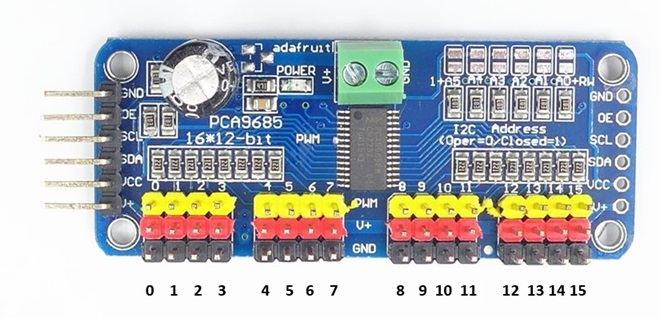
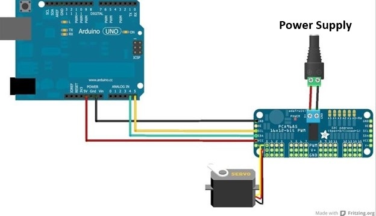

# ECS Robotics Jousting Robot

## Robotics Club Jousting Robot Tutorial

Welcome, Robotics Club members! In this tutorial, we will look at some of the challenges you’ve faced with the Freenove 4WD car kits and the additional servo motors for your jousting robots. By the end of this guide, you will understand how to:

1. Use the PCA9685 module to connect multiple servos.
2. Power the servos correctly.
3. Test and control servos using Arduino Uno.
4. Understand and modify the provided code.

Let’s get started!

---

### 1. **Challenge: Connecting Multiple Servos**

The Freenove 4WD car kit only provides **one servo connection**. To create the jousting arm and additional parts, we need more servo connections. This is where the **PCA9685 servo driver board** comes in handy.

The PCA9685 can control up to **16 servos** using the 6 pin slot for the bluetooth connection. It connects via Inter-Integrated Circuit (I2C) communication, which allows us to send signals to all 16 channels with minimal wiring. See [Wikipedia I2C](https://en.wikipedia.org/wiki/I%C2%B2C) for more information on I2C.

Here’s how the pins on the PCA9685 work:

- **Channel 0**: Bottom pin triple near the 6-pin connector.
- **Channel 15**: Top pin triple at the opposite end of the board.



---

### 2. **Challenge: Powering the PCA9685 and Servos**

Initially, the servos didn’t work because the PCA9685 module needs its **own power supply** to function properly. Servos require more current than the Arduino board can provide.

**Solution**:

- Use a **4-AA battery pack** (6V total) to power the PCA9685. Connect the battery pack’s **positive (red)** wire to the V+ terminal on the PCA9685 and the **negative (black)** wire to GND.
- This external power supply ensures the servos recieve the power they need to operate.




---

### 3. **Testing the PCA9685 with Servos**

Here’s a simple test program to check that your PCA9685 and servos are working properly. This code uses the **Adafruit PWM Servo Driver library**, which makes controlling the PCA9685 very easy.

#### **Code to Test PCA9685 and Servos**

```c++
#include <Wire.h>
#include <Adafruit_PWMServoDriver.h>

Adafruit_PWMServoDriver pwm = Adafruit_PWMServoDriver();

#define SERVOMIN 150 // Minimum pulse length count
#define SERVOMAX 600 // Maximum pulse length count

void setup() {
  pwm.begin();
  pwm.setPWMFreq(60); // Set frequency to 60 Hz for servos
  Serial.begin(9600);
}

void loop() {
  Serial.println("Testing servos...");
  for (int channel = 0; channel < 16; channel++) {
    Serial.print("Testing channel: ");
    Serial.println(channel);
    pwm.setPWM(channel, 0, SERVOMIN); // Move servo to minimum position
    delay(1000);
    pwm.setPWM(channel, 0, SERVOMAX); // Move servo to maximum position
    delay(1000);
    pwm.setPWM(channel, 0, 0);        // Turn off the servo signal
    delay(1000);
  }
}
```

---

### 4. **Code Explanation**

Here’s a breakdown of what the code is doing:

- **`#include <Wire.h>` and `#include <Adafruit_PWMServoDriver.h>`**:
   These include libraries for I2C communication and controlling the PCA9685 board.

   > **Explanation**: Think of `#include` as a way of pasting the library's code at the top of your file. This makes all the functions and definitions from the library accessible in your code.

- **`Adafruit_PWMServoDriver pwm = Adafruit_PWMServoDriver();`**:
   Initializes the PCA9685 driver object.

- **`SERVOMIN` and `SERVOMAX`**:
   These values control the range of motion for your servos. You can adjust these values to fine-tune the movement.

   > **`#define` Explanation**: The `#define` directive creates constants. For example, `#define SERVOMIN 150` means wherever `SERVOMIN` appears in the code, it will be replaced with `150`. This helps make the code more readable and easier to modify.

- **`pwm.begin()`**:
   Initializes the PCA9685 board.

- **`pwm.setPWMFreq(60)`**:
   Sets the PWM frequency to 60 Hz, which is the standard frequency for servo motors.

- **`pwm.setPWM(channel, 0, SERVOMIN);`**:
   Sends a PWM signal to a servo at a specific channel to move it to its minimum position.

- **`pwm.setPWM(channel, 0, SERVOMAX);`**:
   Moves the servo to its maximum position.

- **`delay(1000);`**:
   Adds a 1-second pause between movements to observe the motion clearly.

- **`for (int channel = 0; channel < 16; channel++)`**:
   Loops through all 16 channels on the PCA9685 board, testing each one.

   > **`for` Loop Explanation**: The `for` loop has three parts:
   > 1. `int channel = 0;`: Initializes the variable `channel` to 0.
   > 2. `channel < 16;`: Sets the condition to continue the loop as long as `channel` is less than 16.
   > 3. `channel++`: Increments `channel` by 1 after each iteration.
   > Inside the loop, the code runs for the current value of `channel`, then moves to the next.

   > **Tip**: Channel 0 is at the bottom near the power connector, and channel 15 is at the top of the PCA9685 board.

---

### 5. **Next Steps**

Now that the servos are functional with the Arduino Uno R4 WiFi, there are a few additional steps to complete:

1. **Test Setup on Car Kits**:
   - So far, we have only tested the setup using the Arduino Uno R4 WiFi. The next step is to transfer this configuration to the Freenove 4WD car kits and verify it works with their existing hardware.
   - Ensure all components, including the PCA9685 module and servos, integrate seamlessly with the car’s control systems.

2. **Control Servos Using RF Controller**:
   - Examine the RF controller code and the car’s main control code to determine how to utilize the `pot1Pin` and `pot2Pin` potentiometers to control additional servos.
   - Adapt the current servo control logic to allow input from the RF controller, ensuring smooth operation of the servos during gameplay.

---

### 6. **Additional Resources**

To help you further, here are some excellent resources for learning and troubleshooting:

1. **Freenove Tutorials**:
   - [Freenove 4WD Car Kit Documentation](http://freenove.com/fnk0041)
   - [Freenove Tutorials](http://freenove.com/tutorial)

2. **Arduino Documentation**:
   - [Arduino Official Documentation](https://docs.arduino.cc/)
   - [C++ for Arduino](https://docs.arduino.cc/arduino-cloud/guides/arduino-c/)

3. **Adafruit PCA9685 Guide**:
   - [Adafruit PCA9685 Servo Driver](https://learn.adafruit.com/16-channel-pwm-servo-driver)

---

### 7. **Troubleshooting Tips**

- **Servo Not Moving?**

  - Check that the PCA9685 has its external power supply connected.
  - Check that the AA batteries are working.
  - Check that the correct channel is being used in the code.

- **Unexpected Servo Behavior?**

  - Adjust the `SERVOMIN` and `SERVOMAX` values to match your specific servos.
  - Ensure the wires are connected to the correct pins (signal, power, ground).

---

### Conclusion

With this tutorial, you now know how to:

1. Use the PCA9685 to connect multiple servos.
2. Test and control servos using the provided code.
3. Troubleshoot common servo and power issues.

Have fun building and testing your jousting robots! If you encounter any issues or need help, don’t hesitate to ask.

Happy jousting!
